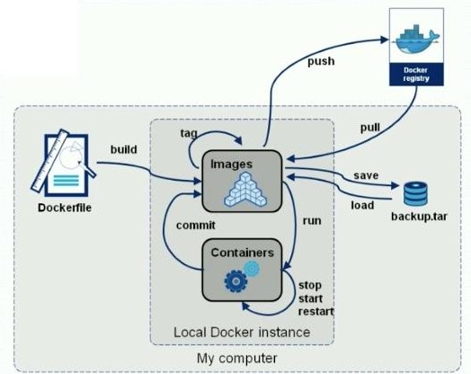

# Docker入门

[Docker安装与卸载]: ./Docker安装与卸载.md


[Docker常用命令]: ./Docker常用命令.md


[ Docker安装Nginx]: ./Docker安装Nginx.md
[Docker安装Tomcat]: ./Docker安装Tomcat.md

[Docker安装MySQL5.7]:./Docker安装MySQL5.7.md


Docker安装Redis

```shell
# 在Linux创建配置文件
mkdir -p /usr/local/Docker/Redis/conf
touch /usr/local/Docker/Redis/conf/redis.conf

# 启动Redis
docker run --name Redis -d -p 6379:6379 -v /usr/local/Docker/Redis/data:/data -v /usr/local/Docker/Redis/conf/redis.conf:/etc/redis/redis.conf redis redis-server /etc/redis/redis.conf

# 连接Redis
docker exec -it Redis redis-cli
```


[ Docker提交镜像 ]:  ./Docker提交镜像.md


# Docker Hub 私服

[Docker Hub私服]: ./DockerHub私服.md


# Docker容器数据卷

[ Docker容器数据卷.md ]: ./Docker容器数据卷.md


# Dockerfile

[Dockerfile.md]: ./Dockerfile.md




# Docker Network

[Docker-Network]: ./Docker-Network.md


---

# Docker Compose

> - 定义、运行多容器的Docker应用工具
>
> - **使用 YAML 配置应用服务**
>
> - 使用一个简单的命令就能创建和启动配置的所有服务
>
>   
>
> - 所有环境（生产、开发等）都可以使用 Docker Compose

> 使用 Docker Copmose 的三部曲： 
>
> 1. 使用 Dockerfile 定义应用的环境，保证应用在任何地方都能运行
> 2. 在 `docker-compose.yml` 中定义 `services` ，那么这些服务能够在独立的环境一起运行
> 3. `docker-compose up` 启动


[DockerCompose]: ./DockerCompose.md


# DockerSwarm

[ DockerSwarm ]: ./DockerSwarm.md