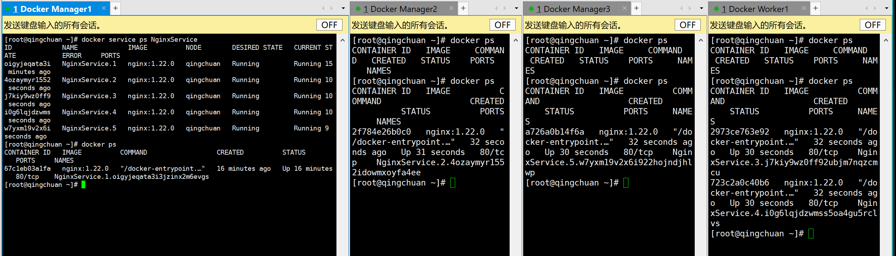

# 初识docker swarm


- 查看帮助信息

```shell
# 查看帮助信息
[root@qingchuan ~]# docker swarm --help

Usage:  docker swarm COMMAND

Manage Swarm

Commands:
  ca          Display and rotate the root CA
  init        Initialize a swarm
  join        Join a swarm as a node and/or manager
  join-token  Manage join tokens
  leave       Leave the swarm
  unlock      Unlock swarm
  unlock-key  Manage the unlock key
  update      Update the swarm

Run 'docker swarm COMMAND --help' for more information on a command.
[root@qingchuan ~]# 

```

- 初始化帮助信息

```shell
[root@qingchuan ~]# docker swarm init --help

Usage:  docker swarm init [OPTIONS]

Initialize a swarm

Options:
      --advertise-addr string                  Advertised address (format: <ip|interface>[:port])
      --autolock                               Enable manager autolocking (requiring an unlock key to start a stopped manager)
      --availability string                    Availability of the node ("active"|"pause"|"drain") (default "active")
      --cert-expiry duration                   Validity period for node certificates (ns|us|ms|s|m|h) (default 2160h0m0s)
      --data-path-addr string                  Address or interface to use for data path traffic (format: <ip|interface>)
      --data-path-port uint32                  Port number to use for data path traffic (1024 - 49151). If no value is set or is set to 0, the
                                               default port (4789) is used.
      --default-addr-pool ipNetSlice           default address pool in CIDR format (default [])
      --default-addr-pool-mask-length uint32   default address pool subnet mask length (default 24)
      --dispatcher-heartbeat duration          Dispatcher heartbeat period (ns|us|ms|s|m|h) (default 5s)
      --external-ca external-ca                Specifications of one or more certificate signing endpoints
      --force-new-cluster                      Force create a new cluster from current state
      --listen-addr node-addr                  Listen address (format: <ip|interface>[:port]) (default 0.0.0.0:2377)
      --max-snapshots uint                     Number of additional Raft snapshots to retain
      --snapshot-interval uint                 Number of log entries between Raft snapshots (default 10000)
      --task-history-limit int                 Task history retention limit (default 5)
[root@qingchuan ~]# 

```

- 初始化

```shell
[root@qingchuan ~]# docker swarm init --advertise-addr 192.168.74.145
Swarm initialized: current node (rk3m2ygpfxb5kh07cs60lpkka) is now a manager.

To add a worker to this swarm, run the following command:

    docker swarm join --token SWMTKN-1-53otcb5fejjm7hvfsildbg4yo8n364bcktm4dhh1u8erl7c9gg-1ccwajfxcyd7a0b3v3n6v24ug 192.168.74.145:2377

To add a manager to this swarm, run 'docker swarm join-token manager' and follow the instructions.

[root@qingchuan ~]# 

```

- join-token 

  ```shell
  [root@qingchuan ~]# docker swarm join-token --help
  
  Usage:  docker swarm join-token [OPTIONS] (worker|manager)
  
  Manage join tokens
  
  Options:
    -q, --quiet    Only display token
        --rotate   Rotate join token
  [root@qingchuan ~]# 
  ```

  

  - `docker swarm join-token manager`

  - `docker swarm join-token worker` 

    > [root@qingchuan ~]# docker swarm join-token worker
    > Error response from daemon: This node is not a swarm manager. Worker nodes can't be used to view or modify cluster state. Please run this command on a manager node or promote the current node to a manager.
    > [root@qingchuan ~]# 
    >
    > 这两个命令只能在manager里使用

- 加入worker

```shell
[root@qingchuan ~]# docker swarm join --token SWMTKN-1-53otcb5fejjm7hvfsildbg4yo8n364bcktm4dhh1u8erl7c9gg-1ccwajfxcyd7a0b3v3n6v24ug 192.168.74.145:2377
This node joined a swarm as a worker.
```

> [root@qingchuan ~]# docker swarm join --token SWMTKN-1-53otcb5fejjm7hvfsildbg4yo8n364bcktm4dhh1u8erl7c9gg-1ccwajfxcyd7a0b3v3n6v24ug 192.168.74.145:2377
>
> Error response from daemon: rpc error: code = Unavailable desc = connection error: desc = "transport: Error while dialing dial tcp 192.168.74.145:2377: connect: no route to host"
>
> Manager没关防火墙


- 加入manager

```shell
[root@qingchuan ~]# docker swarm join --token SWMTKN-1-53otcb5fejjm7hvfsildbg4yo8n364bcktm4dhh1u8erl7c9gg-0y66x2mml4qu170p0by3v2v2q 192.168.74.145:2377
This node joined a swarm as a manager.
[root@qingchuan ~]# 

```

> [root@qingchuan ~]# docker swarm join --token SWMTKN-1-53otcb5fejjm7hvfsildbg4yo8n364bcktm4dhh1u8erl7c9gg-0y66x2mml4qu170p0by3v2v2q 192.168.74.145:2377
> Error response from daemon: manager stopped: can't initialize raft node: rpc error: code = Unknown desc = could not connect to prospective new cluster member using its advertised address: rpc error: code = Unavailable desc = connection error: desc = "transport: Error while dialing dial tcp 192.168.74.147:2377: connect: no route to host"
>
> 待加入的Manager防火墙没关


- 查看节点信息
  - `Leader` 和 `Reachable` 都是主节点

```shell
# 节点信息
[root@qingchuan ~]# docker node ls
ID                            HOSTNAME    STATUS    AVAILABILITY   MANAGER STATUS   ENGINE VERSION
vgphfqvsxi328squn1nmjqkqg                 Unknown   Active                          
nyxz9xbxkrv6g20w9d0lkj0lw                 Unknown   Active                          
r290jmz30ebxoqu8kf0vfn1e4                 Unknown   Active                          
ij6ocimfv8zpdj63wgf2zng47     qingchuan   Ready     Active         Reachable        20.10.17
q4ot6l646z4f8zc0g0uj2iuy4     qingchuan   Ready     Active         Reachable        20.10.17
rk3m2ygpfxb5kh07cs60lpkka *   qingchuan   Ready     Active         Leader           20.10.17
uee1a4z0vvgsxpjtj2o76xr9i     qingchuan   Ready     Active                          20.10.17
koj24my144igjwcwtigascl2h     qingchuan   Ready     Active                          20.10.17

# 因为防火墙的原因，第一个worker和两个manager第一次没添加成功
# 所以有三个未知状态的节点
# 这里删除这些节点
[root@qingchuan ~]# docker node rm vgphfqvsxi328squn1nmjqkqg nyxz9xbxkrv6g20w9d0lkj0lw r290jmz30ebxoqu8kf0vfn1e4
vgphfqvsxi328squn1nmjqkqg
nyxz9xbxkrv6g20w9d0lkj0lw
r290jmz30ebxoqu8kf0vfn1e4

# 再次查看
[root@qingchuan ~]# docker node ls
ID                            HOSTNAME    STATUS    AVAILABILITY   MANAGER STATUS   ENGINE VERSION
ij6ocimfv8zpdj63wgf2zng47     qingchuan   Ready     Active         Reachable        20.10.17
koj24my144igjwcwtigascl2h     qingchuan   Ready     Active                          20.10.17
q4ot6l646z4f8zc0g0uj2iuy4     qingchuan   Ready     Active         Reachable        20.10.17
rk3m2ygpfxb5kh07cs60lpkka *   qingchuan   Ready     Active         Leader           20.10.17
uee1a4z0vvgsxpjtj2o76xr9i     qingchuan   Ready     Active                          20.10.17
[root@qingchuan ~]# 
```

```shell
[root@qingchuan ~]# docker network ls
NETWORK ID     NAME              DRIVER    SCOPE
608641e5d413   bridge            bridge    local
7d2299deaa23   docker_gwbridge   bridge    local
8798f92e45c9   host              host      local
bwthal8q5h9a   ingress           overlay   swarm
4f4996f8d447   none              null      local
[root@qingchuan ~]# 

```


# docker swarm 搭建步骤

1. 准备安装好 docker 的服务器<font color=color size=5>Manager数量 至少为3</font>-->raft协议
2. 作为 `Manager` 的服务器关闭防火墙
3. 选择一台Manager进行初始化操作 `docker swarm init --advertise-addr <IP>`
4. 使用`docker swarm join-token manager`查看添加manager的命令，复制展示的命令，添加manager节点
5. 使用`docker swarm join-token worker` 查看添加worker的命令，复制展示的命令，添加worker节点
6. `docker node ls` 查看节点信息


# Docker Service

```shell
[root@qingchuan ~]# docker service --help

Usage:  docker service COMMAND

Manage services

Commands:
  create      Create a new service
  inspect     Display detailed information on one or more services
  logs        Fetch the logs of a service or task
  ls          List services
  ps          List the tasks of one or more services
  rm          Remove one or more services
  rollback    Revert changes to a service's configuration
  scale       Scale one or multiple replicated services
  update      Update a service

Run 'docker service COMMAND --help' for more information on a command.
[root@qingchuan ~]# 

```


- 创建服务

  `docker service create -p 8888:80 --name NginxService nginx:1.22.0`

```shell
[root@qingchuan ~]# docker service create -p 8888:80 --name NginxService nginx:1.22.0
fsh4d8sndoglanpuwehhccr9c
overall progress: 1 out of 1 tasks 
1/1: running   
verify: Waiting 5 seconds to verify that tasks are stable...
verify: Waiting 5 seconds to verify that tasks are stable...
verify: Waiting 5 seconds to verify that tasks are stable...
verify: Waiting 5 seconds to verify that tasks are stable...
verify: Waiting 5 seconds to verify that tasks are stable...
verify: Waiting 4 seconds to verify that tasks are stable...
verify: Waiting 4 seconds to verify that tasks are stable...
verify: Waiting 4 seconds to verify that tasks are stable...
verify: Waiting 4 seconds to verify that tasks are stable...
verify: Waiting 4 seconds to verify that tasks are stable...
verify: Waiting 3 seconds to verify that tasks are stable...
verify: Waiting 3 seconds to verify that tasks are stable...
verify: Waiting 3 seconds to verify that tasks are stable...
verify: Waiting 3 seconds to verify that tasks are stable...
verify: Waiting 3 seconds to verify that tasks are stable...
verify: Waiting 2 seconds to verify that tasks are stable...
verify: Waiting 2 seconds to verify that tasks are stable...
verify: Waiting 2 seconds to verify that tasks are stable...
verify: Waiting 2 seconds to verify that tasks are stable...
verify: Waiting 2 seconds to verify that tasks are stable...
verify: Waiting 1 seconds to verify that tasks are stable...
verify: Waiting 1 seconds to verify that tasks are stable...
verify: Waiting 1 seconds to verify that tasks are stable...
verify: Waiting 1 seconds to verify that tasks are stable...
verify: Waiting 1 seconds to verify that tasks are stable...
verify: Service converged 
[root@qingchuan ~]#
```

- 动态扩缩容

```shell
docker service update --replicas 10 NginxService
```

```shell
[root@qingchuan ~]# docker service scale --help

Usage:  docker service scale SERVICE=REPLICAS [SERVICE=REPLICAS...]

Scale one or multiple replicated services

Options:
  -d, --detach   Exit immediately instead of waiting for the service to converge
[root@qingchuan ~]# docker service scale NginxService=5
```

- 查看服务状态 

```shell
[root@qingchuan ~]# docker service ps NginxService 
ID             NAME             IMAGE          NODE        DESIRED STATE   CURRENT STATE            ERROR     PORTS
oigyjeqata3i   NginxService.1   nginx:1.22.0   qingchuan   Running         Running 15 minutes ago             
4ozaymyr1552   NginxService.2   nginx:1.22.0   qingchuan   Running         Running 10 seconds ago             
j7kiy9wz0ff9   NginxService.3   nginx:1.22.0   qingchuan   Running         Running 10 seconds ago             
i0g6lqjdzwms   NginxService.4   nginx:1.22.0   qingchuan   Running         Running 10 seconds ago             
w7yxm19v2x6i   NginxService.5   nginx:1.22.0   qingchuan   Running         Running 9 seconds ago              
[root@qingchuan ~]# 
```




- 在同一个docker swarm 的服务器视为一个整体，即使我只有一台服务器在跑，访问其他服务器一样能访问

  

- 删除服务

```shell
[root@qingchuan ~]# docker service rm NginxService 
NginxService
[root@qingchuan ~]# docker service ls
ID        NAME      MODE      REPLICAS   IMAGE     PORTS
[root@qingchuan ~]# 
```


---

# 小结

- **swarm**
  - 管理和编排docker集群
  - 其他docker节点可以加入集群
  - 节点分为manager、worker
  - manager可以管理和工作；worker只能工作
- **node**
  - 安装了docker的服务器

- **service**
  - 服务
  - 运行在manager节点或worker节点
- **task**
  - 一个服务有多个任务 