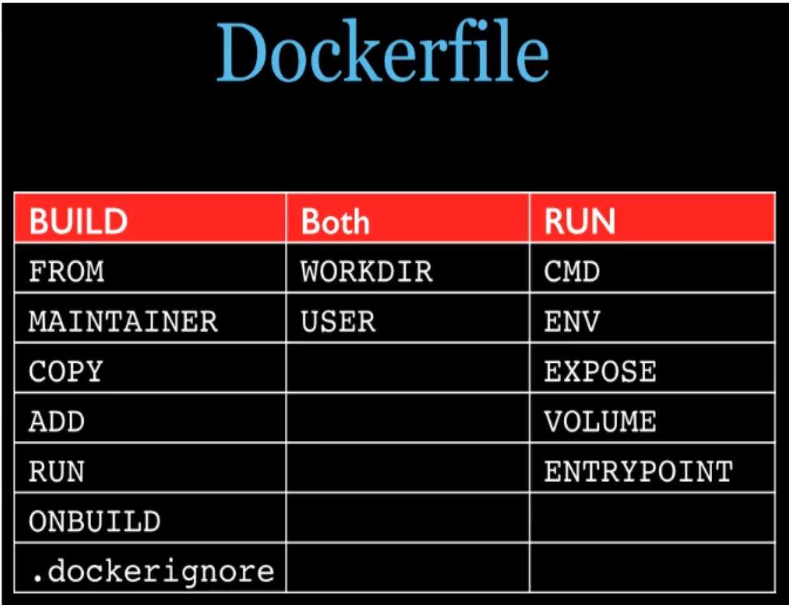

# Dockerfile 基础知识

- 每条保留字指令都必须为大写指令且后面要跟随至少一个参数
- 指令按照从上到下，顺序执行
- `#` 表示注释
- 每条指令都会创建一个新的镜像层并对镜像进行提交


# Docker 执行 Dockerfile 的大致流程

1. docker 从基础镜像运行一个容器
2. 执行一条指令对容器进行修改
3. 提交新的镜像层
4. docker 再基于新提交的镜像运行一个容器
5. 执行 Dockerfile 的下一条指令，直到所有指令执行完毕


- 编写 `Dockerfile` 文件
- 构建 `docker build -t 新镜像名:TAG .` 
- 运行 `docker run -it 新镜像名:TAG`

# Dockerfile 保留字

[Dockerfile reference | Docker Documentation](https://docs.docker.com/engine/reference/builder/)

| 保留字     | 说明                                                         |
| ---------- | ------------------------------------------------------------ |
| FROM       | 基础镜像，Dockerfile 第一条必须是FROM                        |
| MAINTAINER | 镜像维护者的姓名和邮箱                                       |
| RUN        | **容器构建时**（docker build）需要运行的命令；有shell和exec两种格式，shell格式 等同于在shell终端执行该命令 |
| EXPOSE     | 容器对外暴露端口                                             |
| WORKDIR    | 指定进入容器的默认工作目录                                   |
| ENV        | 在构建镜像过程中设置环境变量                                 |
| USER       | 指定该镜像以什么用户执行，默认是root                         |
| VOLUME     | 容器数据卷                                                   |
| ADD        | 将宿主机的文件拷贝进镜像，且自动处理URL和解压tar压缩包       |
| COPY       | 类似ADD，拷贝文件和目录到镜像                                |
| CMD        | **指定容器启动后要做的事**，和RUN相似，也有shell和exec两种格式。<font color=red>Dockerfile 中可以有多个CMD指令，但只有最后一个生效，CMD指令会被 docker run 的命令参数替换掉</font> |
| ENTRYPOINT | 指定容器启动时要运行的命令，类似CMD指令。<font color=red>但ENTRYPOINT  不会被 docker run 的命令参数覆盖，且这些命令参数会传递给ENTRYPOINT指令指定的程序</font> |





# 实例——Docker部署SpringBoot项目

- 创建 SpringBoot 项目并打包
- 上传至 Docker 服务器
- 编辑 `Dockerfile`

```shell
[root@qingchuan SpringBoot]# vim Dockerfile 
[root@qingchuan SpringBoot]# cat Dockerfile 
# 使用Java8基础镜像
FROM java:8
# 作者
MAINTAINER 清川
# 将jar包添加到容器并更名
ADD Docker-SpringBoot-1.0-SNAPSHOT.jar Docker-SpringBoot.jar
# 运行jar包
RUN bash -c 'touch Docker-SpringBoot.jar'
ENTRYPOINT ["java","-jar","/Docker-SpringBoot.jar"]
# 暴露端口
EXPOSE 80
[root@qingchuan SpringBoot]# 
```

- 构建

```shell
[root@qingchuan SpringBoot]# docker  build -t docker_springboot:1.0 .
Sending build context to Docker daemon  16.57MB
Step 1/6 : FROM java:8
 ---> d23bdf5b1b1b
Step 2/6 : MAINTAINER 清川
 ---> Running in b6a05c576902
Removing intermediate container b6a05c576902
 ---> 0beb9909d0b7
Step 3/6 : ADD Docker-SpringBoot-1.0-SNAPSHOT.jar Docker-SpringBoot.jar
 ---> 528f809a8e0d
Step 4/6 : RUN bash -c 'touch Docker-SpringBoot.jar'
 ---> Running in 28e6dc23a15e
Removing intermediate container 28e6dc23a15e
 ---> 8c580fe7a3fe
Step 5/6 : ENTRYPOINT ["java","-jar","/Docker-SpringBoot.jar"]
 ---> Running in 528e44378561
Removing intermediate container 528e44378561
 ---> 953cc3cd893f
Step 6/6 : EXPOSE 80
 ---> Running in 376e32915479
Removing intermediate container 376e32915479
 ---> 2ddaf369d5ee
Successfully built 2ddaf369d5ee
Successfully tagged docker_springboot:1.0
```

- 运行

```shell
[root@qingchuan SpringBoot]# docker run --name SpringBoot -d -p 80:80 docker_springboot:1.0 
413976ce4144e84166313734386400de32fe71b8dc05273e41b0d654c8b297e2
[root@qingchuan SpringBoot]# docker ps
CONTAINER ID   IMAGE                   COMMAND                  CREATED         STATUS         PORTS                               NAMES
413976ce4144   docker_springboot:1.0   "java -jar /Docker-S…"   3 seconds ago   Up 2 seconds   0.0.0.0:80->80/tcp, :::80->80/tcp   SpringBoot

```

- 测试

```shell
[root@qingchuan SpringBoot]# curl 192.168.74.143:80/docker-test
Get Successfully[root@qingchuan SpringBoot]# 
[root@qingchuan SpringBoot]# curl localhost/docker-test
Get Successfully[root@qingchuan SpringBoot]# 
[root@qingchuan SpringBoot]# 
```


# 虚悬镜像

-  仓库名和标签名都是 `<none>` 的镜像
- dangling image
- `docker images ls -f dangling=true` 查看所有虚悬镜像
- `docker  images prune` 删除所有虚悬镜像